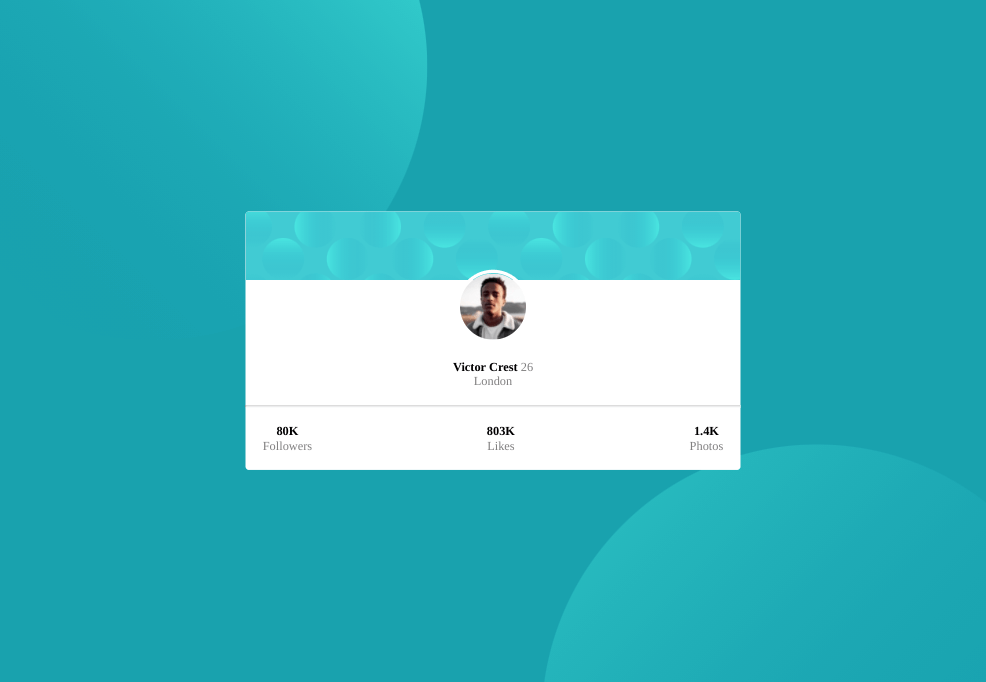
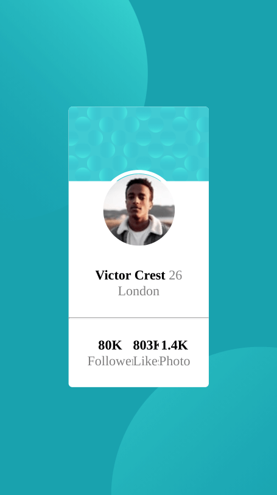

# Frontend Mentor - Profile card component solution

This is a solution to the [Profile card component challenge on Frontend Mentor](https://www.frontendmentor.io/challenges/profile-card-component-cfArpWshJ). Frontend Mentor challenges help you improve your coding skills by building realistic projects. 

## Table of contents

- [Overview](#overview)
  - [The challenge](#the-challenge)
  - [Screenshot](#screenshot)
  - [Links](#links)
- [My process](#my-process)
  - [Built with](#built-with)
  - [What I learned](#what-i-learned)
  - [Continued development](#continued-development)

## Overview

### The challenge

- Build out the project to the designs provided

### Screenshot

### Links

- Live Site URL: [Github Pages](https://jdegand.github.io/profile-card-component/)

## My process

### Built with

- CSS custom properties
- Flexbox

### What I learned

### Continued development

- Semantic HTML5 markup
- Could have a before and an after for background images
- remove redundant overflow from css
